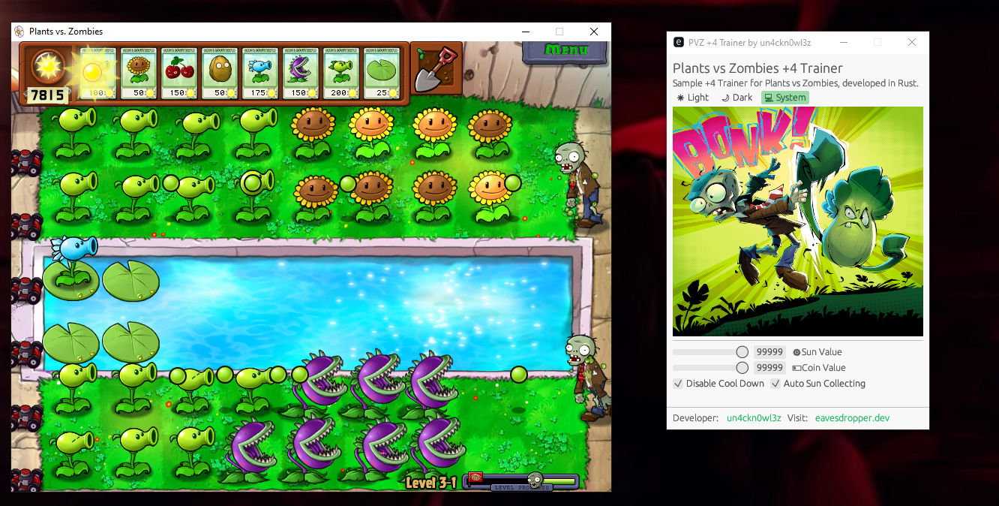

# 🌻 Plants vs Zombies +4 Trainer

Sample +4 Trainer for **Plants vs Zombies**, developed in **Rust**.  
This trainer allows you to modify in-game values like sun, coins, and more!

## ✨ Features

- 🌞 **Sun Value Hack** – Instantly set your sun points.
- 💰 **Coin Hack** – Modify your coin amount.
- 🌞 **Auto-Collect Sun** – Automatically collect suns when they fall.
- 🥶 **Disable Cooldown** – Instantly reuse plants without waiting.

---

## 🛠️ Dependencies

This project uses the following Rust crates:

```toml
[dependencies]
libmem = "5.0.4"
egui = "0.31.1"
eframe = "0.31.1"
egui_extras = { version = "0.31.1", features = ["default", "all_loaders"] }
env_logger = "0.11.8"
image = { version = "0.25.6", features = ["jpeg", "png"] }

[dependencies.windows-sys]
version = "0.59"
features = [
    "Win32_UI_WindowsAndMessaging",
]
```

## 📸 Screenshots


## 📦 Building
To build the project, simply run:
```bash
cargo build --profile release
```

## ⚠️ Disclaimer
This trainer is intended for educational purposes only.
Please use it responsibly and only on games you legally own.

## 📜 License
This project is licensed under the MIT License.
